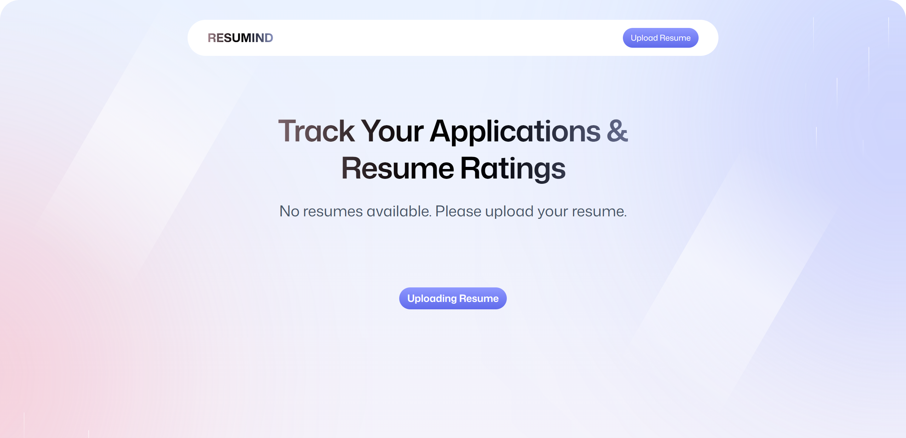
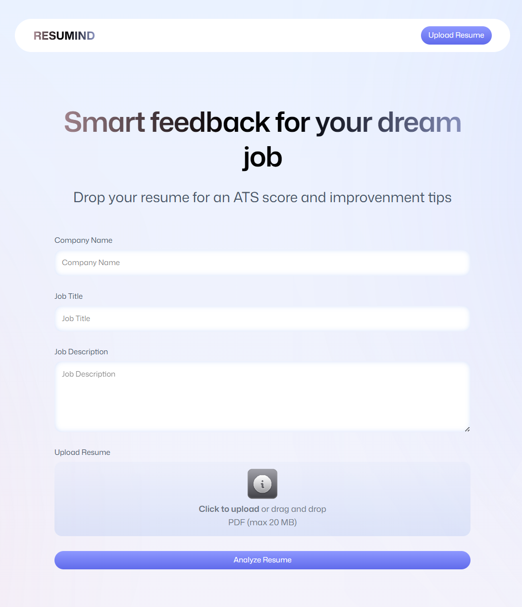
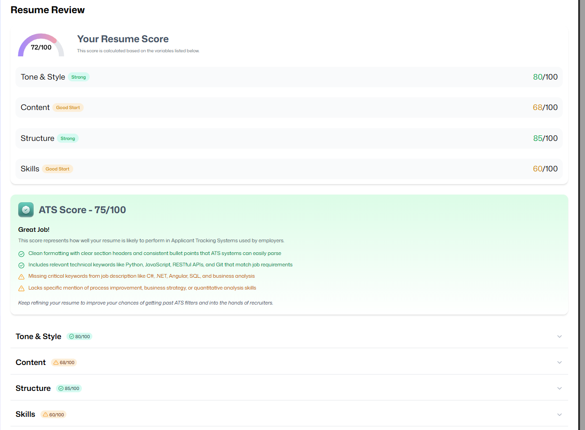

# 🧠 AI-Powered Applicant Tracking System (Resumind)

An AI-driven full-stack web application that simulates a production-style Applicant Tracking System (ATS) workflow.  
Users upload resumes, receive structured AI-generated feedback aligned with job descriptions, and track performance across submissions.

This project emphasizes scalable metadata indexing, asynchronous processing pipelines, structured LLM parsing, and system design thinking.

---

## 🧩 Problem & Motivation

Modern job seekers often rely on generic resume builders without understanding how Applicant Tracking Systems evaluate resumes.

Resumind was built to simulate an ATS-style evaluation pipeline by:

- Matching resumes against job descriptions
- Generating structured improvement feedback
- Providing actionable scoring breakdowns
- Allowing users to track submission history

The goal is to bridge the gap between human-written resumes and machine-based screening systems.

---

## 🚀 Key Engineering Highlights

- Designed structured KV indexing strategy using `resume:${uuid}` for efficient wildcard retrieval (`kv.list('resume:*')`).
- Built asynchronous multi-stage pipeline (PDF upload → image conversion → AI analysis → structured parsing → persistence).
- Implemented fault-tolerant workflow control using `try/catch/finally` to maintain consistent system state.
- Developed safe bulk deletion utility using `Promise.all` to guarantee atomic file removal before KV flush.
- Parsed unstructured LLM responses into strongly-typed feedback schemas.
- Architected separation between file storage (FS) and metadata persistence (KV).

---

## 🤖 AI Feedback Design

The AI pipeline enforces structured output to reduce hallucination and ensure deterministic parsing.

Prompt strategy includes:

- Explicit scoring categories
- JSON-only output enforcement
- Schema-aligned response format

Example structured feedback schema:

{
  "overallScore": 82,
  "keywordMatch": 78,
  "experienceRelevance": 85,
  "formatClarity": 80,
  "improvementSuggestions": []
}

Unstructured LLM output is parsed and validated before being persisted.

---

## 🧠 System Architecture Overview

1. User uploads a PDF resume.
2. PDF converted to image for preview rendering.
3. Files stored in FS layer.
4. Resume metadata stored in KV using structured key pattern.
5. AI engine analyzes resume against job description.
6. Structured feedback persisted.
7. Dashboard renders resume cards via wildcard KV query.

---

## 📷 Demo

### 🔹 Dashboard Overview

### 🔹 Resume Upload Interface

### 🔹 AI Resume Review & ATS Score

---

## 📈 Scalability Considerations

If scaled beyond prototype stage:

- Replace KV metadata store with indexed database
- Introduce queue-based async processing for AI tasks
- Add caching layer for repeated resume analysis
- Move file storage to object storage with CDN support

---

## 🧩 Tech Stack

- React + TypeScript
- React Router
- Tailwind CSS
- File System Storage (FS)
- Key-Value Metadata Store (KV)
- LLM-powered analysis pipeline

---

## ⚙️ Installation

### Install dependencies

npm install

### Run locally

npm run dev

